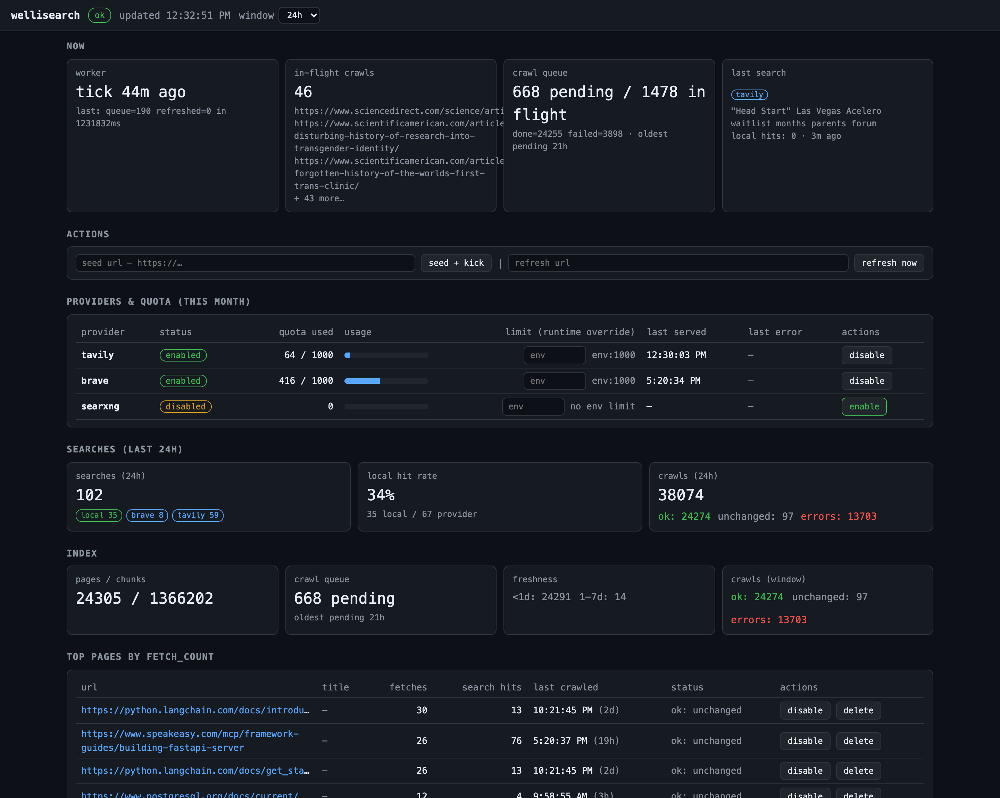

# wellisearch

**Web search, but for LLMs.**

[](https://github.com/WellingtonHQ/wellisearch/actions/workflows/build.yml)
[](https://www.python.org/)
[](LICENSE)

wellisearch gives your AI agent a **self-hosted way to search the web and read web pages** — and it keeps a growing library of every page it has seen, so the second time you ask about the same topic, the answer comes from your own shelf: **instant, and it costs zero API credits**.

Think of it as a personal, always-learning search box for your LLM. Ask a question, it answers from its own library if it can; otherwise it goes out to the search providers (Tavily, Brave, EXA, You.com) — and quietly files the results away so next time it's free.



## Why wellisearch?

- **Free repeat searches.** Pages your agent reads get stored locally. The next search on the same topic is answered by your own index — no provider credits burned.
- **One pipeline, three doors.** The exact same search is exposed as **MCP tools** (for your LLM), a **REST API** (for scripts), and a live **dashboard** (for you).
- **LLM-friendly output.** Results come back as clean, readable Markdown — not raw HTML soup or a wall of JSON.
- **Self-hosted & private.** Your index, your data, your machine. No third-party SaaS in the loop.
- **Degrades gracefully.** Provider down or quota exhausted? It fails over to the next one, and to your local index as a last resort — your agent still gets an answer.

## How it works (the 30-second version)

1. **You ask a question.** Your LLM calls `search_web`.
2. **Local first.** If the answer is already in the library, it's served instantly — free.
3. **Otherwise, out to the providers.** It walks them in the configured priority order until one answers — and you can reorder that priority at runtime from the dashboard.
4. **It files the results away.** In the background, the pages it just found are saved into the library, so the next similar question is free.
5. **Read the pages.** `fetch_page` / `fetch_pages` hand the LLM the page content as clean Markdown.

## What you get

| Surface | For | What it does |
|---|---|---|
| **MCP tools** | your LLM / agent | `search_web`, `fetch_page`, `fetch_pages`, `index_stats`, `seed_url`, `refresh_page` |
| **REST API** | scripts & automation | the same pipeline over HTTP (`/api/search`, `/api/fetch`, …) |
| **Dashboard** | you | live activity: index size, hit-rate, provider quotas, recent crawls — plus one-click controls |

## Quick start

**Requirements:** Docker, a running Postgres (with `pgvector`), and optionally API keys for Tavily / Brave (below). The crawler is native and in-process — no separate crawler service.

```bash
# 1. Get the code
git clone https://github.com/WellingtonHQ/wellisearch.git
cd wellisearch

# 2. Configure
cp .env.example .env
#    open .env and set your Postgres password and (optionally) provider keys

# 3. Build and start
docker compose up -d --build

# 4. Watch it boot
docker logs -f wellisearch
```

Then open the dashboard at **http://localhost:8780/**.

> **Note on Postgres.** Out of the box, wellisearch expects a Postgres reachable at host `postgres` on a Docker network named `postgres-net` (the author's layout, where Postgres lives in a separate `infra` project). `docker compose up` will fail if that network doesn't exist — create it, or edit the `networks` block in [`compose.yml`](compose.yml) to match your setup. The app **creates its own database on first boot**, so there's nothing to pre-create.

## Connect your LLM (MCP)

Point any MCP client (Open WebUI, Claude Desktop, opencode, …) at the
endpoint:

```
http://localhost:8780/mcp/http
```

That's **Streamable HTTP** (stateless — a server restart can't strand a
client).

Either way, your agent gets six tools:

| Tool | What it does |
|---|---|
| `search_web(query)` | Search the web (local-first) |
| `fetch_page(url)` | Read one page as clean Markdown |
| `fetch_pages(urls, …)` | Read several pages at once, under a shared size budget |
| `index_stats()` | How big and fresh is the library? |
| `seed_url(url)` | Save a specific page for later |
| `refresh_page(url)` | Re-fetch a page that may have changed |

Here's what `search_web` hands back — a clean Markdown document your LLM reads directly, no JSON to parse:

```
Source: local
Degraded: false

Title: pgvector — Vector Search in Postgres
URL: https://github.com/pgvector/pgvector
Last Crawled: 2026-08-20T14:03:11Z
Snippet: pgvector is an extension for adding approximate and exact similarity
search directly to PostgreSQL.
---
Title: PostgreSQL 18 Documentation
URL: https://www.postgresql.org/docs/current/
Snippet: ...
```

The header tells the story: `Source: local` means it came from the library (free); `Source: tavily` (or `brave` / `exa` / `youcom`) means a provider answered and the pages are being filed away for next time.

**Examples:** opencode / Claude Desktop (Streamable HTTP) — `http://wellisearch:8780/mcp/http` (or `http://127.0.0.1:8780/mcp/http`). Open WebUI — use wellisearch's OpenAPI tool server: add wellisearch as an OpenAPI tool server with URL `http://wellisearch:8780/owui/openapi.json` (or `http://127.0.0.1:8780/owui/openapi.json` from the host), sending the same API key as the bearer token.

## The dashboard

Open **http://localhost:8780/** in a browser. It auto-refreshes and shows:

- index size and freshness
- search hit-rate by source (local vs. each provider) over time
- provider quota usage vs. limits
- the crawl queue and recent activity
- your most-read pages
- one-click actions: seed a URL, refresh a page, toggle a provider, set a quota

If you set `WELLISEARCH_API_KEY`, paste it into the header bar once and it's remembered.

## Provider keys (optional but recommended)

wellisearch works with no keys at all — without provider keys it serves from its local index only. For the best results, add one or more providers to `.env`:

| Provider | Env var | Free tier* |
|---|---|---|
| **Tavily** | `TAVILY_API_KEY` | ~1,000 credits/mo, no card |
| **Brave** | `BRAVE_API_KEY` | ~1,000 queries/mo |
| **EXA** | `EXA_API_KEY` | ~1,000 credits/mo, no card |
| **You.com** | `YOUCOM_API_KEY` | credit-based ($100 starter credits) |

All four are interchangeable — a search is answered by **one of** them, in whatever order is currently set. The default order is `tavily, brave, exa, youcom` (from `SEARCH_PROVIDERS`), and you can reorder it at any time from the dashboard or `PUT /api/providers/order`.

\* Free tiers change over time — check with the provider. The exact numbers barely matter: wellisearch keeps a monthly quota ledger per provider, skips exhausted ones *before* making any API call, and fails over automatically.

---

## Under the hood (for the curious)

Everything above is **one process in one container**: a FastAPI app serving the REST API, the MCP server, and the dashboard, plus a background worker task. Postgres (with `pgvector`) is the single store; the native in-process crawler is the single crawling path. The full reference docs live in [`docs/`](docs/README.md):

| Document | What it covers |
|---|---|
| [architecture.md](docs/architecture.md) | System topology, process model, how a request flows through the container |
| [search-pipeline.md](docs/search-pipeline.md) | `search_web` step by step: local-first, gateway failover, degraded mode, speculative indexing |
| [ranking.md](docs/ranking.md) | How local results are scored: full-text + trigram + vector, fused in SQL |
| [data-model.md](docs/data-model.md) | Every table, column, and index in the schema |
| [indexing.md](docs/indexing.md) | How pages are crawled, chunked, embedded, and kept fresh |
| [api.md](docs/api.md) | Full REST + MCP reference with request/response shapes |
| [deployment.md](docs/deployment.md) | Docker/compose, startup sequence, full configuration reference, operations |


### Common ops

```bash
docker logs -f wellisearch                                        # app + worker logs
docker compose exec wellisearch python -m wellisearch.worker --once   # drain the queue now
docker compose exec wellisearch python -m wellisearch.reindex         # re-embed after an EMBED_MODEL change
docker compose exec wellisearch python -m wellisearch.reindex --force # re-embed everything
curl -s http://localhost:8780/health | python3 -m json.tool          # dependency health
```

- **Changing the embedding model** (`EMBED_MODEL`) invalidates all stored vectors — update `.env`, run `reindex`, restart.
- **Backups:** all data lives in Postgres (database `wellisearch`); back it up with `pg_dump`.
- **Nothing is auto-deleted.** Pages are disabled or removed via the dashboard or `PATCH/DELETE /api/pages/{url}`.

### Configuration

All knobs are environment variables in `.env` (annotated in [`.env.example`](.env.example)): Postgres, provider order/keys/timeouts/quotas, embedding model, search thresholds, fetch truncation budgets, worker pacing, and the API key. The complete reference with defaults is in [docs/deployment.md](docs/deployment.md#configuration-reference).

### Troubleshooting

- **`Source:` shows a provider you didn't expect** — check the current order (`GET /api/providers` → `order` / `order_source`, or the dashboard) and the `last_error` per provider; the gateway always fails over in the active order and captures the error chain.
- **Search works but the index stays empty** — the worker may not be draining; check the queue depth in the dashboard, run `worker --once` manually, and read the logs.
- **Slow first search** — the embedding model loads on first use (pre-downloaded into the Docker image at build time).
- **Dashboard 401** — set the API key in the header bar (stored in your browser).

### Development

```
src/wellisearch/
  app.py            FastAPI routes, auth middleware, worker startup, MCP mount
  search_web.py     the search pipeline (shared by REST + MCP)
  fetch.py          fetch_page / fetch_pages (stored-first, budgeted)
  tools.py          the six MCP tools
  providers/        gateway: tavily, brave, exa, youcom adapters + failover
  index.py          store_page: chunk → embed → upsert
  crawler.py        native crawler facade (the single crawling path)
  queue.py          crawl queue: enqueue/dedupe + worker kick
  worker.py         background worker (drain queue + watchlist refresh)
  truncation.py     fetch_pages budget strategies (smart/head/tail/even/priority)
  config.py         every env knob, with defaults
  schema.sql        DDL + the ranking function (applied at startup)
  static/           the dashboard (vanilla JS, no build step)
```

**Tests:**

```bash
python tests/test_units.py    # pure logic — no network, no DB (what CI runs)
python tests/test_db.py       # schema + ranking function (needs Postgres)
python tests/e2e_test.py      # live end-to-end against a running container
```

## License

[MIT](LICENSE) — do whatever you want, just keep the attribution.
