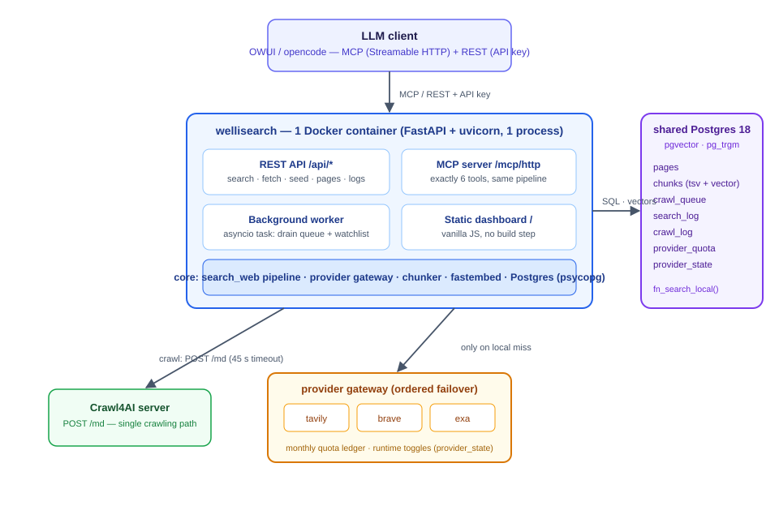

# Architecture

## Topology

```
images/architecture.svg
```



wellisearch is **one container** (FastAPI + uvicorn, a single Python process)
talking to **three external services**:

| Dependency | Role | Config |
|---|---|---|
| shared Postgres 18 | index, logs, queue, quota ledger, ranking function | `POSTGRES_*` (defaults host `postgres`, db `wellisearch`, admin db `postgres`) |
| Crawl4AI server | the only crawling path (`POST /md` → fit markdown) | `CRAWL4AI_URL` (default `http://crawl4ai:11235`), `CRAWL4AI_API_KEY` |
| search providers | fallback web search, ordered failover | `SEARCH_PROVIDERS`, `TAVILY_API_KEY`, `BRAVE_API_KEY`, `SEARXNG_URL` |

All three are reachable via the shared Docker network (hostnames `postgres`,
`crawl4ai`, `searxng`). Postgres is **shared infrastructure outside this
repo** — wellisearch self-creates its app database at startup
(`POSTGRES_ADMIN_DB`, default `postgres`) and applies `schema.sql` idempotently.

## Process model

One uvicorn worker process runs, in a single asyncio event loop:

1. **FastAPI app** — REST routes, the mounted MCP ASGI app (`/mcp/http`
   stateless Streamable HTTP), and the static dashboard (mounted last,
   catch-all).
2. **The background worker** — an `asyncio.Task` started in the startup
   hook (`app.py:_startup`): sleeps `WORKER_INTERVAL_MIN` (30 min) between
   ticks, and also reacts to **debounced kicks** whenever the crawl queue
   receives items (`queue.kick_worker`, debounce `KICK_DEBOUNCE_S` = 5 s).
   It is not a separate process, container, or queue consumer — there is no
   broker.
3. **The provider gateway** — a lazily-created singleton
   (`providers.get_gateway()`) holding one shared `httpx.AsyncClient`
   (timeout `PROVIDER_TIMEOUT_S` = 20 s) and the ordered provider adapters.

On shutdown the worker task is cancelled, the gateway client closed, and the
psycopg pool released. At boot, any `crawl_queue` rows stuck in
`in_flight` (crash mid-drain) are reset to `pending`
(`db.queue_reset_in_flight`).

## Component inventory

| Component | File(s) | Responsibility |
|---|---|---|
| REST API | `app.py` | routes; thin wrappers over the shared pipeline |
| MCP server | `mcp.py`, `tools.py` | six tools over the same handlers; stateless Streamable HTTP transport |
| Search pipeline | `search_web.py` | local-first search, threshold, gateway, logging, enqueue |
| Provider gateway | `providers/__init__.py` + adapters | ordered failover, availability gates, quota ledger |
| Ranking core | `schema.sql` → `fn_search_local` | hybrid FTS/trigram/vector RRF in Postgres |
| Indexing | `index.py`, `chunk.py`, `embed.py` | `store_page`: hash → chunk → embed → upsert |
| Crawling | `crawler.py` | Crawl4AI client, `fit_markdown`, health check |
| Queue | `queue.py` | enqueue/dedupe, in-flight set, debounced kick |
| Worker | `worker.py` | tick: drain queue + watchlist refresh |
| Read path | `fetch.py`, `truncation.py` | `fetch_page` / `fetch_pages` under a char budget |
| Data access | `db.py` | psycopg pool, SQL helpers, quota/state upserts |
| Config | `config.py` | pydantic-settings; every knob in one place |
| Dashboard | `static/index.html` | vanilla JS; calls the REST API; no build step |

## Request flow (any search)

```
LLM client
    │  MCP (/mcp/http) REST (GET /api/search)
   ▼
tools.py::search_web ──────────── app.py::api_search
   └──────────────┬──────────────────┘
                  ▼
        search_web.py::search_web()          ← single implementation
                  │
     ┌────────────┴─────────────┐
     ▼                          ▼
 fn_search_local (PG)      gateway (providers/)
 hybrid ranking            tavily → brave → searxng
     │                          │
     └────────────┬─────────────┘
                  ▼
        log_search (search_log)
                  ▼
        Markdown contract out
        (Title / URL / Snippet blocks, ---)
```

Notes:

- **Auth**: when `WELLISEARCH_API_KEY` is set, a middleware requires the key
  (as `Authorization: Bearer <key>` or `X-API-Key`) on every `/api/*` and
  `/mcp/*` request; comparison is constant-time (`hmac.compare_digest`).
  `/health` and the dashboard are open.
- **MCP mount order**: `app.mount("/mcp", mcp_asgi())` happens *before* the
  catch-all static mount, so `/` serves the dashboard and `/mcp/*` serves the
  MCP endpoints.
- **No crawl in the response path**: searches never block on a crawl. On a
  gateway hit the top result URLs are enqueued for background indexing
  (`queue.enqueue(source="search")` + kick), so the *next* query for the
  same topic can be served locally.

## Deployment topology (typical stack)

```
┌──────────────┐     ┌──────────────┐     ┌──────────────┐     ┌──────────────┐
│ wellisearch  │────▶│ shared PG 18 │     │ Crawl4AI     │     │ SearXNG      │
│ (this repo)  │     │ (infra)      │     │ (infra)      │     │ (infra)      │
└──────────────┘     └──────────────┘     └──────────────┘     └──────────────┘
      │  (optional: Tavily/Brave APIs — outbound HTTPS)
```

See [deployment.md](deployment.md) for compose, networking, and the
configuration reference.

## Why this shape

- **Local-first** inverts the usual LLM-search cost model: repeated queries
  (which dominate agentic traffic) become free, and the provider quota
  ledger (`TAVILY_QUOTA_MONTHLY`, `BRAVE_QUOTA_MONTHLY`) is a hard backstop,
  not the primary budget.
- **One process** means one event loop to reason about; all concurrency is
  bounded asyncio (crawl parallelism `CRAWL_MAX_PARALLEL` = 3, provider
  client shared). CPU-bound work (embedding, chunking) is pushed off the loop
  via `asyncio.to_thread`.
- **Postgres does the ranking** (`fn_search_local`) so REST, MCP, and the
  dashboard all see identical results, and the ranking is versionable SQL
  instead of in-process Python that differs per client.
- **The read path is the indexing loop**: `fetch_page` on an unindexed URL
  crawls and stores it, so anything the LLM reads becomes searchable.
