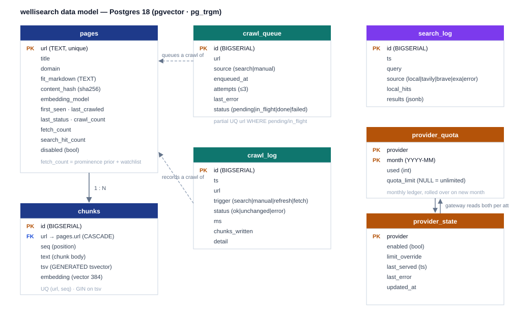

# Data model

All DDL lives in `src/wellisearch/schema.sql` (Postgres 18 + `vector` +
`pg_trgm`) and is applied **idempotently at startup** by `db.startup`
(`CREATE … IF NOT EXISTS` / `CREATE OR REPLACE FUNCTION`), so re-running it is
safe. The schema is the single source of truth for the index, the queue, the
logs, and the provider ledger.

```
images/data-model.svg
```



## Overview

| Table | Grain | Purpose |
|---|---|---|
| `pages` | one row per indexed URL | stored content + counters + status |
| `chunks` | one row per chunk of a page | FTS tsvector + embedding + text |
| `crawl_queue` | one row per pending/in-flight crawl | durable background work |
| `search_log` | one row per search request | observability + local-hit rate |
| `crawl_log` | one row per crawl attempt | observability (trigger, status, timing) |
| `event_log` | one row per operational event | dashboard log view (worker, providers, admin) |
| `provider_quota` | one row per provider per month | usage ledger |
| `provider_state` | one row per provider | runtime toggles + last error |

Plus the stored function `fn_search_local(query, qvec, k)` (see
[ranking.md](ranking.md)).

## pages

One row per indexed URL. `url` is the natural primary key.

| Column | Type | Notes |
|---|---|---|
| `url` | `text` **PK** | the indexed page |
| `title` | `text` | from crawl, or first `#` heading of the markdown |
| `domain` | `text` | lowercased netloc; indexed (`pages_domain_idx`) |
| `fit_markdown` | `text` | the Crawl4AI fit-markdown body (the stored content) |
| `content_hash` | `text` | `sha256(fit_markdown)`; the `unchanged` short-circuit key |
| `embedding_model` | `text` | model that produced the vectors; a model change invalidates them |
| `first_seen` | `timestamptz` | set once at insert |
| `last_crawled` | `timestamptz` | freshness-decay input for ranking |
| `last_status` | `text` | `ok` \| `unchanged` \| `error` \| `http_<code>` |
| `crawl_count` | `int` | total crawl attempts |
| `fetch_count` | `int` | **priority/prominence counter** — bumped on every `fetch_page`/`fetch_pages` read; drives watchlist order and the additive prominence prior |
| `search_hit_count` | `int` | times served as a local result |
| `disabled` | `bool` | soft-exclude from results (kept in DB); toggled via `PATCH /api/pages/{url}` |

## chunks

The ranking unit. One row per chunk (≤ `MAX_CHUNK_TOKENS` = 800 tokens), in
document order.

| Column | Type | Notes |
|---|---|---|
| `id` | `bigserial` **PK** | |
| `url` | `text` **FK → pages(url)** | `ON DELETE CASCADE` |
| `seq` | `int` | chunk position (0-based) |
| `text` | `text` | chunk body (markdown) |
| `tsv` | `tsvector` **GENERATED** | `to_tsvector('english', text) STORED` — FTS leg |
| `embedding` | `vector(384)` | vector leg; `NULL` until embedded |
| `last_crawled` | `timestamptz` | copied from the page at write time |

Indexes:

- `chunks_url_seq_uq` — `UNIQUE (url, seq)`
- `chunks_tsv_gin` — `GIN (tsv)` for the FTS leg (and the candidate set of
  the bounded trigram leg, `trigram-rewrite.md`)
- `chunks_trgm_gin` — `GIN (text gin_trgm_ops)` — **currently unused** since
  the trigram rewrite (kept as a rebuild-able fallback; ~1.3 GB, drops
  write amplification if removed)
- `chunks_vec_hnsw` — `HNSW (embedding vector_cosine_ops)` for the vector leg

## crawl_queue

Durable background work, survives restarts.

| Column | Type | Notes |
|---|---|---|
| `id` | `bigserial` **PK** | |
| `url` | `text` | what to crawl |
| `source` | `text` | `search` (gateway miss) \| `manual` (seed) |
| `enqueued_at` | `timestamptz` | FIFO order |
| `attempts` | `int` | incremented per claim; capped at `QUEUE_MAX_ATTEMPTS` (3) |
| `last_error` | `text` | from the last failure |
| `status` | `text` | `pending` → `in_flight` → `done` \| `failed` |

- **Dedupe**: `UNIQUE (url) WHERE status IN ('pending','in_flight')`
  (`crawl_queue_url_pending_uq`) — the same URL is queued at most once while
  it is pending or in flight. Enqueue is
  `INSERT … ON CONFLICT (url) WHERE … DO NOTHING`.
- **Crash recovery**: at boot, rows stuck in `in_flight` (died mid-drain)
  are reset to `pending` (`db.queue_reset_in_flight`).
- **Retry**: a failed claim re-enqueues as `pending` (transient) until
  `attempts` hits the cap, then `failed`.

## search_log

One row per search request (all sources). Powers the local-hit-rate metric.

| Column | Type | Notes |
|---|---|---|
| `id` | `bigserial` **PK** | |
| `ts` | `timestamptz` | indexed `DESC` |
| `query` | `text` | |
| `source` | `text` | `local` \| `tavily` \| `brave` \| `searxng` |
| `local_hits` | `int` | good-local count (or all-local in degraded mode) |
| `results` | `jsonb` | full result set |

## crawl_log

One row per crawl attempt.

| Column | Type | Notes |
|---|---|---|
| `id` | `bigserial` **PK** | |
| `ts` | `timestamptz` | indexed `DESC` |
| `url` | `text` | |
| `trigger` | `text` | `search` \| `fetch` \| `refresh` \| `manual` |
| `status` | `text` | `ok` \| `unchanged` \| `error` \| `http_<code>` |
| `ms` | `int` | wall-clock duration |
| `chunks_written` | `int` | `0` when `unchanged` |
| `detail` | `text` | error detail (≤500 chars) |

## event_log

One row per operational event — the "message + info" stream behind the
dashboard's Log view (merged with `crawl_log` + `search_log` by
`GET /api/logs`). Emitters: worker (tick / crash / retention sweep), provider
gateway (served / failed / crashed / empty / quota exhausted / all-exhausted),
app (startup, seed, refresh, page + provider changes).

| Column | Type | Notes |
|---|---|---|
| `id` | `bigserial` **PK** | |
| `ts` | `timestamptz` | indexed `DESC` |
| `message` | `text` | human-readable one-liner |
| `info` | `jsonb` | structured detail (nullable) |

## provider_quota

Monthly usage ledger, one row per provider per calendar month.

| Column | Type | Notes |
|---|---|---|
| `provider` | `text` **PK** | `tavily` \| `brave` (searxng is self-hosted, no quota) |
| `month` | `text` **PK** | `YYYY-MM` (UTC) |
| `used` | `int` | incremented by `quota_bump` on every served request |
| `quota_limit` | `int` | `NULL` = unknown; gateway still fails over on HTTP 429 |

`quota_used_limit(provider)` returns `(used, limit)` where `limit` is the
runtime `provider_state.limit_override` if set, else the env default
(`TAVILY_QUOTA_MONTHLY` / `BRAVE_QUOTA_MONTHLY`).

## provider_state

Runtime gateway state — persists across restarts, so a toggle you flip in the
dashboard survives a redeploy.

| Column | Type | Notes |
|---|---|---|
| `provider` | `text` **PK** | |
| `enabled` | `bool` | default `true`; `false` = skip in failover (runtime toggle) |
| `limit_override` | `int` | overrides the env monthly limit when non-NULL |
| `last_served` | `timestamptz` | when it last answered a search |
| `last_error` | `text` | most recent failure reason (shown in dashboard + `/api/providers`) |
| `updated_at` | `timestamptz` | |

## Index & constraint summary

| Index | Table | Type | Serves |
|---|---|---|---|
| `pages_domain_idx` | pages | B-tree | dashboard/domain lookups |
| `chunks_url_seq_uq` | chunks | unique B-tree | chunk ordering + dedupe |
| `chunks_tsv_gin` | chunks | GIN | FTS leg + trigram-leg candidates |
| `chunks_trgm_gin` | chunks | GIN (trgm) | unused since trigram rewrite (fallback) |
| `chunks_vec_hnsw` | chunks | HNSW | vector leg |
| `crawl_queue_url_pending_uq` | crawl_queue | partial unique | queue dedupe |
| `search_log_ts_idx` | search_log | B-tree `DESC` | recent-searches |
| `crawl_log_ts_idx` | crawl_log | B-tree `DESC` | recent-crawls |
| `event_log_ts_idx` | event_log | B-tree `DESC` | dashboard log view |

## Deleting / disabling

- `DELETE /api/pages/{url}` → hard delete (chunks cascade via the FK).
- `PATCH /api/pages/{url} {"disabled": true}` → soft disable: the page stays
  in `pages`/`chunks` but is excluded from `fn_search_local` output
  (`p.disabled = false` filter). Re-enable to bring it back without
  re-crawling.
