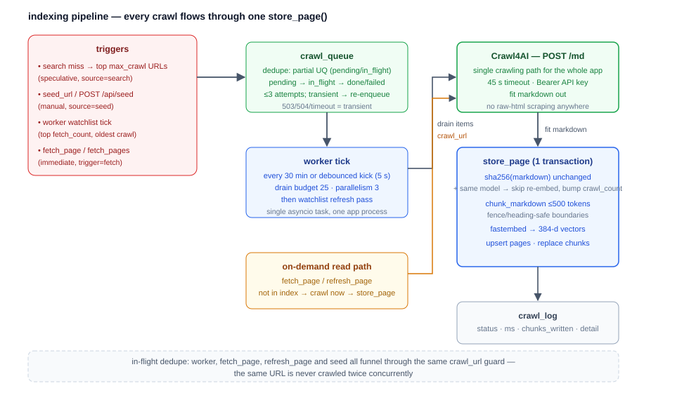

# Indexing pipeline

Every crawl — from a queue drain, a watchlist refresh, an on-demand read, or a
manual seed — funnels through the same two functions:

```
crawler.fit_markdown(url)   →   index.store_page(url, markdown, title)
```

The invariant: **one crawling path, one storage path.** There is no
second scraper and no second way content gets into the index.

```
images/indexing.svg
```



## Triggers (what causes a crawl)

| Trigger | `crawl_log.trigger` | Queue? | Entry point |
|---|---|---|---|
| Gateway search miss (top `SEARCH_MAX_CRAWL` result URLs) | `search` | yes (`source=search`) | `search_web.py` → `queue.enqueue` |
| Manual seed | `search` (worker drain) | yes (`source=manual`) | `seed_url` tool / `POST /api/seed` |
| Worker watchlist refresh | `refresh` | no (direct) | `worker._refresh_watchlist` |
| On-demand read of an unindexed URL | `fetch` | no (direct) | `fetch_page` / `fetch_pages` |
| Force re-crawl | `manual` | no (direct) | `refresh_page` tool / `POST /api/refresh` |
| One-shot re-crawl of all indexed pages (refresh crawl-time values) | `recrawl` | no (direct) | `python -m wellisearch.recrawl` |

## The queue (durable, deduped)

`queue.enqueue(url, source)`:

- Inserts into `crawl_queue` **unless** the URL is already `pending` or
  `in_flight` (partial unique index), returning whether it was newly queued.
- Calls `queue.kick_worker()` — a **debounced** kick
  (`KICK_DEBOUNCE_S` = 5 s): a burst of enqueues coalesces into a single
  worker tick instead of N.

Queue rows are durable across restarts. At boot, any row stuck in
`in_flight` (process died mid-drain) is reset to `pending`.

## The worker tick

`worker.tick()` does two jobs, both bounded by a wall-clock deadline
(`WORKER_TICK_BUDGET_MIN` = 15 min) and a per-run budget
(`WORKER_BUDGET_PER_RUN` = 25 URLs), with crawl concurrency capped at
`CRAWL_MAX_PARALLEL` (3) via a semaphore.

**1. Drain the queue.** Pull up to `budget × 2` pending rows (FIFO),
claim each (`pending → in_flight`, `attempts += 1`), crawl + store, then mark
`done` or re-enqueue/`failed` per the attempt cap.

**2. Refresh the watchlist.** Re-crawl the pages the LLM actually uses:

```sql
SELECT url FROM pages WHERE disabled = false
ORDER BY fetch_count DESC, last_crawled ASC
LIMIT WORKER_BUDGET_PER_RUN
```

— most-fetched, oldest-crawled first. This is what keeps high-traffic pages
fresh (and therefore above the ranking freshness decay).

**Tick scheduling** (`worker.run_forever`):

- every `WORKER_INTERVAL_MIN` (30 min) unconditionally, and
- on a debounced kick whenever the queue receives work (the kick calls
  `tick()` directly, so the interval timer is the only loop).

`python -m wellisearch.worker --once` runs a single tick and exits (manual
drain; it resets stuck `in_flight` rows first).

## Native crawler (the only crawling path)

`crawler.fit_markdown(url)` runs the native in-process crawler and returns
`(title, markdown)` — the page's `<title>`/`og:title` (`None` when the page
has none) plus clean "fit" markdown (main content, no chrome). Details:

- Engine: `crawl/` package — http → browser → stealth tiers with per-site
  extractors (see `docs/native-crawler-design.md`).
- Timeout: `CRAWL_TIMEOUT_S` (45 s).
- A blocked/failed crawl raises `CrawlError` carrying an `http_<code>` /
  `error` status label, which becomes `last_status` and the `crawl_log`
  status. Transient codes (503/504/timeout) are the ones the queue retries.
- `crawler.health()` backs `GET /health`'s `crawler` field.

## store_page (hash → chunk → embed → upsert)

`index.store_page(url, markdown, title=None)` returns `(status,
chunks_written)` where `status ∈ {'ok','unchanged'}`; `title` is the crawled
page title persisted onto the page row.

### 1. Unchanged short-circuit

```python
digest = sha256(markdown)
if existing and existing.content_hash == digest and existing.embedding_model == EMBED_MODEL:
    → bump crawl_count, set last_status='unchanged', last_crawled=now()
    → return ("unchanged", 0)
```

No chunking, no embedding — a re-crawl of an unchanged page is nearly free.
The **model name is load-bearing**: even identical content must be
re-embedded if `EMBED_MODEL` changed, because the vectors are model-specific.
This is why `embedding_model` is stored per page and why a model change
requires `python -m wellisearch.reindex` (see deployment.md).

### 2. Chunk

`chunk_markdown(markdown, MAX_CHUNK_TOKENS)` (`chunk.py`):

- Budget ≈ `MAX_CHUNK_TOKENS` (800) tokens, estimated at **4 chars/token**.
- Splits on **heading boundaries** so each chunk starts at (or under) a
  heading (a chunk carries its own section context).
- **Never splits inside a fenced code block** (a fence may overflow the
  budget but stays intact).
- **Never splits a table row.**
- Merges a trailing stub smaller than ~20% of the budget into the previous
  chunk instead of storing a near-empty tail.

### 3. Embed

`embed(chunks)` (`embed.py`) runs the fastembed singleton
(`EMBED_MODEL` = `sentence-transformers/all-MiniLM-L6-v2`, 384-dim) on a
worker thread (`asyncio.to_thread`) to keep the event loop responsive. A
dimension guard raises if the model's real embedding size ≠ `EMBED_DIMS`
(384), since the schema assumes 384-d vectors.

### 4. Upsert (one transaction)

```
BEGIN
  INSERT INTO pages (…) ON CONFLICT (url) DO UPDATE …   -- content, hash, model, last_crawled, crawl_count+1
  DELETE FROM chunks WHERE url = …
  INSERT INTO chunks (url, seq, text, embedding, last_crawled) …  -- batched (executemany)
COMMIT
```

Chunk replacement is delete-then-insert inside the same transaction, so a
page never half-updates. `seq` preserves document order.

## In-flight dedupe (never crawl a URL twice at once)

`queue.crawl_deduped(url, trigger, fn)` wraps every direct crawl (watchlist,
fetch, refresh, manual) with a shared in-flight set. If two requests for the
same URL arrive concurrently (e.g. two `fetch_page`s, or a fetch racing the
worker), the second waits for the first and reuses its result — the crawler
gets one request per URL per moment, and the result is consistent.

## Reading stored pages (fetch path)

`fetch.py` is the authoritative on-demand read path:

- `fetch_page(url, max_chars?)` — stored fit-markdown if indexed (and not
  disabled), else crawl-on-demand + store. Bumps `fetch_count`.
  Optionally truncates to `max_chars` (head strategy) with a
  `[truncated — N chars omitted]` marker.
- `fetch_pages(urls, …)` — bulk read under a **shared character budget**
  (`FETCH_MAX_CHARS` default 40000 total, `FETCH_PER_PAGE_CHARS` 12000
  per-page) with a swappable strategy (`smart` default; also `head`, `tail`,
  `even`, `priority`). Each page is a clearly delimited
  `Title / URL / From Index / Chars / Truncated / --- / content` section
  (the response opens with a `Strategy / Budget / Pages Fetched / Total
  Chars / Truncated` header); trimmed pages carry a
  `[truncated — N chars omitted, strategy=X]` marker.

The strategy allocates per-page budgets from the shared total, then
`truncation.truncate_page` trims at safe boundaries (never mid-line /
mid-fence) to the allocated size. `priority` weights by `fetch_count` so the
pages the LLM reads most keep the most content under a tight budget.

## Failure & retry semantics

- **Crawl error** → `crawl_log` (`error` / `http_<code>`, ms, detail) +
  `pages.last_status` updated; the URL is re-enqueued (queue) or surfaced as
  an error (direct path) — never silently dropped.
- **Embedding/store error** → transaction rolls back (page unchanged), error
  logged.
- **Unchanged** → not an error; it's the common steady-state outcome for
  watchlist refreshes and is recorded as `status='unchanged'`.

## Observability

- `GET /api/stats` → page/chunk counts, freshness buckets, queue depth,
  worker last-tick stats, in-flight crawls, last search.
- `GET /api/logs/crawls` → recent `crawl_log` (trigger, status, ms,
  chunks_written).
- The dashboard's "Now" panel shows the worker's `last_tick_at` + stats live.
