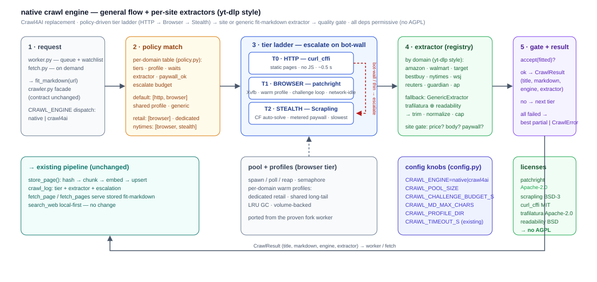
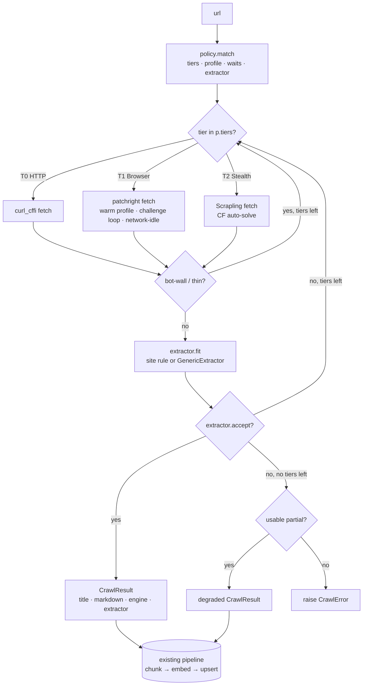

# Native crawl engine — design

**Status:** proposal. Not built yet — the migration is a future branch/PR
(see [§7 Migration plan](#7-migration-plan-future-branchpr)).

**Grounded in:** the engine-gating benchmark
([`benchmarks/engine-gating/ENGINE_GATING_FINDINGS.md`](../benchmarks/engine-gating/ENGINE_GATING_FINDINGS.md)) —
`patchright` (Apache-2.0) matched the AGPL baseline on every bot-wall target
and was stronger on Amazon product data; `Scrapling` (BSD-3) is the only
paywall breaker (2–30× slower, last resort); the native fit-markdown hybrid
beat Crawl4AI `f=fit` on 3 of 4 retail pages.



---

## 1. Goals & constraints

1. **Drop the AGPL.** Replace the Crawl4AI service + its AGPL `nodriver`
   stealth tier with a permissively-licensed engine **inside wellisearch**
   (MIT). Every new dependency must be Apache-2.0 / BSD / MIT.
2. **Contract unchanged.** Callers keep using
   `crawler.fit_markdown(url) -> (title | None, markdown)` and `CrawlError`;
   `worker.py`, `fetch.py`, `queue.py` are untouched.
3. **Hold the bar.** Must clear the gating set: Amazon / Walmart / Target /
   BestBuy item + search (Cloudflare), BGG / Stimson / Medium / CarMax
   (CF / Akamai), NYT / WSJ / Reuters / Guardian / AP, plus the static
   long-tail we index today.
4. **General flow + per-site extractors** (yt-dlp style): one generic
   pipeline that works everywhere, with a registry of per-site extractors
   that take over when the domain is known — each with its own quality gate.
5. **Reversible.** `CRAWL_ENGINE=native|crawl4ai` flag; the Crawl4AI path
   stays until parity is proven, then is removed.

---

## 2. Shape: two axes, bound by a policy table

Like yt-dlp's "one generic downloader + per-site extractors", but split into
two orthogonal axes:

- **Tiers** — *how to get the HTML* (transport + rendering). A generic,
  ordered ladder, escalated on bot-wall:
  `HTTP (curl_cffi) → Browser (patchright) → Stealth (Scrapling)`.
- **Extractors** — *how to turn HTML into fit-markdown* (content). A
  registry selected by domain, with a generic fallback:
  `GenericExtractor` (trafilatura ⊕ readability hybrid) + site extractors
  (`amazon`, `walmart`, …) that anchor on known structure and enforce a
  site-specific **quality gate** (price present, decoys cut, paywall flagged).

A small per-domain **policy table** (`policy.py`) binds the two axes —
which tiers, in what order, which profile, which waits, which extractor,
whether paywall is acceptable. **This table is the single place where what
the benchmark learned lives**, and it is the first thing we tune when a site
changes.

```
                     ┌─────────────┐     ┌──────────────┐
   url ────────────▶ │ 1 · request │────▶│ 2 · policy   │
                     └─────────────┘     └──────┬───────┘
                                                ▼
                     ┌────────────────────────────────────────┐
                     │ 3 · tier ladder (escalate on bot-wall) │
                     │   T0 HTTP  →  T1 BROWSER  →  T2 STEALTH│
                     └──────────────────┬─────────────────────┘
                                        ▼
                     ┌──────────────┐   ┌──────────────┐   ┌──────────────┐
                     │ 4 · extractor│──▶│ 5 · gate     │──▶│ CrawlResult  │
                     │ (registry)  │   │ + result     │   │ (title, md)  │
                     └──────────────┘   └──────────────┘   └──────┬───────┘
                                                                  ▼
                                                    chunk → embed → upsert
```

---

## 3. Layers

### 3.1 Tiers (transport)

| Tier | Lib | When it runs | Cost |
|---|---|---|---|
| **T0 · HTTP** | `curl_cffi` (MIT) | policy says `[http, …]`; static pages, no JS | ~0.5 s |
| **T1 · Browser** | `patchright` (Apache-2.0) | default workhorse; headful under Xvfb; warm per-domain profile; CF/Akamai challenge loop; network-idle wait | seconds |
| **T2 · Stealth** | `Scrapling` `StealthySession` (BSD-3) | last resort — hard CF grids (Target), metered paywall (NYT) | 2–30× slower |

Common protocol:

```python
class Tier(Protocol):
    name: str
    async def fetch(self, url: str, p: Policy) -> Rendered: ...
    # Rendered = (html, title, status, ms, engine, notes)
```

T1 details (port of the proven fork worker, `deploy/docker/nodriver_worker/worker.py`):
spawn/poll/reap pool, `CRAWL_MAX_PARALLEL` semaphore, `new_tab=True`,
UTF-8 patch, settle + **network-idle** wait, and a bounded challenge loop
(detect turnstile → click → verify, `CRAWL_CHALLENGE_BUDGET_S` seconds).

### 3.2 Extractors (content)

- **`GenericExtractor`** (fallback, the "yt-dlp generic IE"):
  `trafilatura` ⊕ `readability-lxml` → **longer wins** → boilerplate trim →
  link normalization → cap at `CRAWL_MD_MAX_CHARS` (default 120k) → title
  from `og:title` / `<title>` / `h1`.
- **`SiteExtractor`** (registry, `for_url()` by domain):

  | Extractor | Anchors / rules | Quality gate |
  |---|---|---|
  | `amazon` | `h1` anchor; buy-box (canonical price = **first `$` after the title**, stock, seller); "About this item"; specs; **hard-cut at first decoy** ("Frequently bought together", "protection plan", "See buying options", "From the brand", "Sponsored", "Customers also viewed"); strip >80-char whitespace runs | title + price present |
  | `walmart` | hero-price `[data-seo-id="hero-price"]` + offer-guard prepend; key-item-features; soft-404 → search recovery | title + price |
  | `target` | network-idle + `data-test="product-tile"` wait; grid extraction | ≥1 product row |
  | `bestbuy` | JSON-LD + grid | ≥1 product row |
  | `nytimes` | metered-paywall detect; body < 2k → `Escalate("stealth")`; else save preview | `paywall=True` flag or full body |
  | `wsj` | paywall-stub detect; save lead | `paywall=True` (content, not engine) |
  | `reuters` / `guardian` / `ap` | generic + related-links trim / head-decoy trim | body ≥ min |

  All return `Fitted(md, title, signals, flags)` and implement
  `accept(fitted) -> bool` (their gate).

- **`botwall.py`** (shared detector): status codes + word-boundary challenge
  markers + thin-content heuristic. Keeps **bot-wall** (escalate) distinct
  from **thin-but-real** (accept + flag).

### 3.3 Policy table

```python
# policy.py — the single place site knowledge lives
POLICY: dict[str, Policy] = {
    "*":              Policy(tiers=["http", "browser"], profile="shared"),
    "amazon.com":     Policy(tiers=["browser"], profile="dedicated",
                             waits=["settle", "network_idle"], extractor="amazon"),
    "walmart.com":    Policy(tiers=["browser"], profile="dedicated", extractor="walmart"),
    "target.com":     Policy(tiers=["browser", "stealth"], profile="dedicated",
                             waits=["settle", "network_idle"], extractor="target"),
    "bestbuy.com":    Policy(tiers=["browser"], profile="dedicated", extractor="bestbuy"),
    "nytimes.com":    Policy(tiers=["browser", "stealth"], extractor="nytimes", paywall_ok=True),
    "wsj.com":        Policy(tiers=["browser"], extractor="wsj", paywall_ok=True),
    "theguardian.com":Policy(tiers=["http", "browser"], extractor="guardian"),
    "apnews.com":     Policy(tiers=["http", "browser"], extractor="ap"),
    "reuters.com":    Policy(tiers=["http", "browser"], extractor="reuters"),
}
```

### 3.4 Pool & profiles

Browser pool (T1): spawn/poll/reap + semaphore, **warm per-domain profiles** —
dedicated for high-risk retail (amazon / walmart / target / bestbuy), shared
for the long-tail — LRU-GC'd, persisted on a volume. Ported from the proven
fork worker.

---

## 4. Proposed file structure

```
wellisearch/
  crawler.py              # facade, UNCHANGED: fit_markdown(url) → (title, md)
                          # now dispatches on CRAWL_ENGINE: native | crawl4ai
  crawl/                  # NEW package — the native engine
    __init__.py
    engine.py             # crawl() core loop: policy → tier ladder → extractor → gate
    policy.py             # POLICY table + domain-suffix match + defaults
    results.py            # Rendered / Fitted / CrawlResult dataclasses
    botwall.py            # bot-wall / 404-shell / challenge detection (shared)
    wait.py               # settle, network-idle, selector waits
    signals.py            # price / stock / feature retention checks (gate helpers)
    pool.py               # browser pool: spawn/poll/reap/semaphore (port of fork worker)
    profiles.py           # warm per-domain profiles: dedicated vs shared, LRU GC
    tiers/
      __init__.py         # Tier protocol
      http.py             # T0 — curl_cffi (TLS/JA3 impersonation, static pages)
      browser.py          # T1 — patchright (headful Xvfb, challenge loop, network-idle)
      stealth.py          # T2 — Scrapling StealthySession (CF auto-solve, paywalls)
    extractors/
      __init__.py         # registry: for_url() → extractor (yt-dlp style)
      base.py             # GenericExtractor: trafilatura⊕readability + trim + cap
      botwall.py          # (shared detector, re-exported)
      amazon.py           # buy-box anchor, canonical price, decoy hard-cut
      walmart.py          # hero-price, offer guard, soft-404 recovery
      target.py           # product-tile wait, grid extraction
      bestbuy.py          # JSON-LD + grid
      nytimes.py          # paywall detect → Escalate("stealth")
      wsj.py              # paywall stub
      reuters.py          # related-links trim
      guardian.py         # related-links trim
      ap.py               # head-decoy trim
  config.py               # + CRAWL_ENGINE, CRAWL_POOL_SIZE, CRAWL_CHALLENGE_BUDGET_S,
                          #   CRAWL_PROFILE_DIR, CRAWL_MD_MAX_CHARS, CRAWL_HTTP_TIER,
                          #   CRAWL_STEALTH_TIER
Dockerfile                # + chromium, Xvfb, fonts, patchright, scrapling,
                          #   curl_cffi, trafilatura, readability-lxml, markdownify
compose.yml               # profiles volume; DISPLAY; (Phase 3: remove crawl4ai service)
```

Dependency delta (all permissive): `patchright`, `scrapling`, `curl_cffi`,
`trafilatura`, `readability-lxml`, `markdownify`, plus Xvfb + Chromium + fonts
in the image.

---

## 5. Algorithm

### 5.1 Core loop (pseudocode)

```python
# crawl/engine.py
def crawl(url) -> CrawlResult:
    p   = POLICY.match(url)                 # domain policy, else default
    ex  = EXTRACTORS.for_url(url)           # site extractor, else GenericExtractor
    attempts = []

    for tier in p.tiers:                    # e.g. [T1] or [T1, T2] or [T0, T1]
        r = tier.fetch(url, p)              # Rendered(html, title, status, ms)
        attempts.append((tier, r))

        if botwall(r):                      # challenge / 404-shell → escalate
            continue
        if isinstance(r, Escalate):         # extractor asked for a higher tier
            tier = by_name(r.tier); r = tier.fetch(url, p)
            continue

        f = ex.fit(r)                       # → Fitted(md, title, signals, flags)
        if ex.accept(f):                    # site quality gate passes
            return CrawlResult(ok=True, md=f.md, title=f.title,
                               engine=tier.name, extractor=ex.name,
                               flags=f.flags, attempts=attempts)

    best = best_partial(attempts)           # all tiers failed
    if best and usable(best):
        return CrawlResult(ok=False, degraded=best, attempts=attempts)
    raise CrawlError(url, "all tiers failed", attempts=attempts)
```

### 5.2 T1 browser fetch (pseudocode)

```python
# crawl/tiers/browser.py
def BrowserTier.fetch(url, p):
    b = POOL.acquire(p.profile_for(url))    # warm per-domain, or shared
    try:
        page = b.new_tab()
        page.goto(url, wait_until="domcontentloaded")
        wait_settle(p)                      # ~1.5–2 s
        if "network_idle" in p.waits:
            page.wait_for_load_state("networkidle", timeout=15_000)

        if looks_like_challenge(page):      # CF turnstile / Akamai
            budget = CRAWL_CHALLENGE_BUDGET_S
            while budget > 0 and challenge_present(page):
                click_turnstile(page)
                wait(3); budget -= 3
            if not challenge_cleared(page):
                raise TierBlocked(url)      # → next tier

        return Rendered(html=page.content(), title=page.title(),
                        status=page.status, engine="patchright")
    finally:
        POOL.release(b)
```

### 5.3 Site extractor (pseudocode — Amazon)

```python
# crawl/extractors/amazon.py
DECOYS = ["Frequently bought together", "protection plan", "See buying options",
          "From the brand", "Sponsored", "Customers also viewed"]

def AmazonExtractor.fit(rendered):
    doc  = parse(rendered.html)
    body = anchor_at(doc, "h1")             # content starts at the product title
    buy  = buy_box(doc)                     # canonical price = first "$" after title
    keep = [buy, about_this_item(doc), specs(doc)]
    cut  = first_occurrence(body, DECOYS)   # hard-cut at the first decoy marker
    md   = to_markdown(keep)[:CRAWL_MD_MAX_CHARS]
    md   = re.sub(r"\n{4,}", "\n\n", md)    # strip >80-char whitespace runs
    return Fitted(md=md, title=buy.title,
                  signals={"price": buy.price, "stock": buy.stock})

def AmazonExtractor.accept(f):
    return f.signals.get("price") and f.title
```

### 5.4 Flow (mermaid)



---

## 6. Config knobs

| Env | Default | Meaning |
|---|---|---|
| `CRAWL_ENGINE` | `crawl4ai` (→ `native` at Phase 3) | which backend `fit_markdown` dispatches to |
| `CRAWL_POOL_SIZE` | `2` | concurrent patchright browsers (T1) |
| `CRAWL_CHALLENGE_BUDGET_S` | `40` | max seconds spent in the CF/Akamai challenge loop per page |
| `CRAWL_MD_MAX_CHARS` | `120000` | fit-markdown cap after trim |
| `CRAWL_PROFILE_DIR` | `/profiles` | volume-backed warm profiles |
| `CRAWL_HTTP_TIER` | `on` | enable/disable T0 |
| `CRAWL_STEALTH_TIER` | `on` | enable/disable T2 (Scrapling) |
| `CRAWL_TIMEOUT_S` | existing | overall per-URL timeout (unchanged) |

---

## 7. Migration plan (future branch/PR)

Reversible, phased, each phase independently shippable behind `CRAWL_ENGINE`:

| Phase | Scope | Exit criterion |
|---|---|---|
| **0** | Add `crawl/` package behind `CRAWL_ENGINE`; default stays `crawl4ai` | zero behavior change; `native` importable |
| **1** | T1 browser tier + pool + `GenericExtractor` + `amazon` / `walmart` extractors + `botwall.py` | parity on the Run-1 retail + CF/Akamai matrix with `crawl4ai` |
| **2** | T0 HTTP + T2 Stealth (Scrapling) + `target` / `bestbuy` + news extractors (NYT/WSJ/Reuters/Guardian/AP) + paywall handling | parity on the Run-2 news + Amazon-decoy + fit-md matrix; `Scrapling` only as escalation |
| **3** | Flip default to `native`; remove Crawl4AI service + `nodriver` worker from compose; drop the fork; update `docs/` + `README.md` | full gating set green, no AGPL dep, wellisearch still MIT |

**Rollback at every phase:** set `CRAWL_ENGINE=crawl4ai`.

**Acceptance (overall):** the Run-1 + Run-2 gating matrix at parity or better;
no AGPL/MPL dependency in the crawl path; wellisearch remains MIT-licensed.

---

## 8. Open questions (resolve during Phase 1/2)

1. **In-process pool vs sidecar process** — recommendation: in-process
   (single wellisearch container), pool is small (2–4 browsers). Confirm the
   16 GB memory ceiling holds under concurrent load.
2. **Is the HTTP tier (T0) on by default?** It saves time on the static
   long-tail and adds a permissive dep (`curl_cffi`, MIT) — leaning yes.
3. **Do we actually need the Stealth tier for Target** (Scrapling is slow), or
   is a dedicated patchright profile + longer network-idle enough? Re-test at
   Phase 2 before committing the tier.
4. **Profile GC + volume size cap** — define LRU eviction and a hard cap so
   profiles can't grow unbounded.
5. **Concurrency + throughput** — the benchmark measured quality + latency, not
   throughput. Add a small concurrent-load check at Phase 1.
