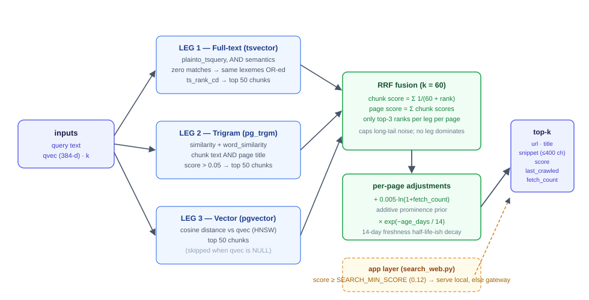

# Ranking (`fn_search_local`)

The local ranking core is a **single Postgres SQL function** —
`fn_search_local(query text, qvec vector(384), k int)` — defined in
`src/wellisearch/schema.sql` and re-applied idempotently at every startup
(`db.startup`). Ranking in the database (not in Python) guarantees the REST
API, the MCP server, and any future client all see identical results.

```
images/ranking.svg
```



## The three legs

Each leg returns the **top 50 chunks** (by its own relevance order) for the
query. Chunks are the unit of ranking; pages are then built from their
chunks.

### Leg 1 — Full-text (tsvector)

- `chunks.tsv` is a generated column:
  `to_tsvector('english', text)` (GIN-indexed, `chunks_tsv_gin`).
- The query is parsed with `plainto_tsquery('english', query)`, which yields
  an **AND** of all lexemes.
- **OR fallback**: if *no* chunk contains every lexeme (normal for
  multi-word queries — the words rarely co-occur in one 800-token chunk),
  the *same lexemes* are re-parsed with `&`→`|` and matched with OR. The
  fallback only runs when the AND leg returns zero rows
  (`NOT EXISTS (SELECT 1 FROM fts_and)`), so a strong exact-phrase page is
  never diluted by weak partial matches.
- Ranking within the leg: `ts_rank_cd(c.tsv, query)` (cover-density
  ranking), `ROW_NUMBER()` ordered by rank desc.

### Leg 2 — Trigram (pg_trgm), bounded

- **Candidates** (≤100 chunks, all index-backed via the tsv GIN):
  - top **50** of the FTS-AND set by `ts_rank_cd` — the strong-overlap pool,
  - plus top **50** of the OR set of the query's **distinctive words** —
    lexemes appearing in < 1% of the corpus (per-word GIN index counts).
    Their OR sets stay small even in long queries, so pages that contain the
    rare word but not every query word (partial matches) stay in the pool
    without scanning the huge common-word OR set (70k–127k rows, 2.4–6 s).
- **Score** within the leg:
  `GREATEST(similarity(cand.text, query), word_similarity(cand.text, query))`
  over the first 1000 chars of each candidate — computed on that ≤100-row
  set only; ranked by score desc.
- Purpose: re-ranks word-overlapping candidates so partial-word and
  typo-ish matches (e.g. "postgres" vs "postgresql") rank well without
  paying for a full-corpus similarity scan.

  > **Why it changed (2026-08):** the original leg ran
  > `GREATEST(similarity(c.text,q), word_similarity(c.text,q),
  > similarity(p.title,q)) > 0.05` over **every chunk** — a full CPU scan.
  > At ~1.34M chunks it took 10–27+ min per search, exhausted the 12-connection
  > pool (30 s `PoolTimeout`s everywhere), and saturated Postgres CPU. The GIN
  > trigram index could not save it: the `GREATEST()` wrapper is not
  > indexable, and even plain `text % query` is non-selective at low threshold
  > on this corpus (one common word's trigrams cover most of the table).
  > Full write-up: `trigram-rewrite.md`.

### Leg 3 — Vector (pgvector)

- `c.embedding <=> qvec` (cosine distance; HNSW index
  `chunks_vec_hnsw` on `vector_cosine_ops`).
- Chunks with a NULL embedding or a NULL `qvec` are excluded — so if query
  embedding fails, the function degrades to FTS + trigram automatically.
- All embeddings are `EMBED_DIMS` = 384-d from
  `EMBED_MODEL` = `sentence-transformers/all-MiniLM-L6-v2` (fastembed).

## Fusion — Reciprocal Rank Fusion with a top-3 cap

Naive RRF over all top-50 chunks has a failure mode: **volume beats
precision**. A page with 50 marginal matches (ranks 15–50 in several legs)
accumulates more RRF mass than a page with 3 excellent matches. This is
exactly what happened when a marketing-heavy page with dozens of loosely
related chunks outranked the authoritative documentation page for
"postgresql documentation reference".

The fix is the **per-page, per-leg top-3 cap**:

```sql
per      AS (SELECT leg, cid, rnk,
             ROW_NUMBER() OVER (PARTITION BY leg, c.url ORDER BY rnk) AS rn_in_page
             FROM leg JOIN chunks c ON c.id = leg.cid),
perpage  AS (SELECT cid, SUM(1.0 / (60.0 + rnk)) AS rrf
             FROM per WHERE rn_in_page <= 3
             GROUP BY cid)
```

Formulas (k_RRF = 60):

```
chunk score   S(c) = Σ_legs  1 / (60 + rank_leg(c))     (only top-3 ranks
                                                        per leg per page)
page score    P(page) = Σ_{c ∈ page} S(c)
```

With the cap, a page contributes **at most 9 RRF terms** (3 legs × 3 ranks)
no matter how many chunks it has, so "a few strong matches" always beats
"many marginal ones".

## Per-page adjustments

```sql
final_score = (P + 0.005 * ln(1 + fetch_count)) * exp(-age_days / 14)
```

### Prominence (additive prior)

`+ 0.005 · ln(1 + fetch_count)` — a gentle bonus for pages the LLM actually
reads (every `fetch_page`/`fetch_pages` read bumps `fetch_count`). It is
**additive, not multiplicative**: with realistic RRF masses (0.05–0.15) it
nudges ties in favor of proven-useful pages without letting popularity
override topical evidence. Magnitude: `fetch_count` 1 → +0.0035, 10 →
+0.012, 100 → +0.023.

(A multiplicative `× (1 + ln(1+fc))` variant was tried and rejected — it
amplified RRF itself and let high-traffic pages dominate; additive is the
fix.)

### Freshness decay

`× exp(−age_days/14)` from `last_crawled` (clamped at 0 for never-crawled).
Half-life ≈ 9.7 days; a 30-day-old page keeps ~11.7% of its score. Combined
with the threshold, stale pages drop out of the serving set unless they are
extremely relevant — and the watchlist worker (`fetch_count` DESC,
`last_crawled` ASC) is what keeps frequently-used pages fresh.

### Filter

`pages.disabled = false` — a page can be soft-disabled (excluded from
results, kept in the DB) via `PATCH /api/pages/{url}`.

## Output

Top `k` rows, ordered by final score:

| Column | Notes |
|---|---|
| `url`, `title` | from `pages` |
| `snippet` | best-scoring chunk's text, whitespace-collapsed, truncated to 400 chars |
| `score` | final adjusted score (double precision) |
| `last_crawled` | timestamptz |
| `fetch_count` | prominence input, surfaced for transparency |

## Worked example (illustrative)

Query: *"postgresql documentation reference"*.
Page X: `fetch_count = 24`, `last_crawled` 3 days ago.

| Chunk | FTS rank | Trigram rank | Vector rank | S(c) |
|---|---|---|---|---|
| c1 | 1 | 2 | 1 | 1/61 + 1/62 + 1/61 = 0.04892 |
| c2 | 3 | — | 5 | 1/63 + 1/65 = 0.03126 |
| c3 | — | 4 | — | 1/64 = 0.01563 |
| **P(X)** | | | | **0.09580** |

```
prominence:  0.005 · ln(1 + 24) = 0.005 · ln 25 = 0.01609
freshness:   exp(−3/14)         = 0.8080
final:       (0.09580 + 0.01609) × 0.8080 = 0.0904
```

A weaker off-topic page (one chunk, rank ~8 in one leg, fresh):

```
S = 1/68 = 0.01471;  final ≈ 0.015  → far below threshold
```

The *relative* ordering — and the fact that X's mass comes from three
distinct legs at top ranks, not from fifty marginal ones — is what the top-3
cap enforces.

## Local-hit gate: `coverage`

The score above is **rank-only** (RRF over the legs' ranks). It is an
arbitrary scale that does not track relevance — off-topic pages can
outscore on-topic ones — so it must never decide local-vs-gateway. That
decision is made by `fn_search_local`'s `coverage` column: the fraction of
the query's content words (the `words` CTE, PG-stemmed, stopwords dropped)
that the page's title + body contains, computed with `to_tsvector(...) @@
to_tsquery(...)` per lexeme.

`search_web` serves local if **any** of the top local results has
`coverage >= LOCAL_MIN_COVERAGE` (default **0.75**, `config.py`); otherwise
it falls through to the provider gateway (local rows stay available as the
degraded-mode fallback).

Calibrated 2026-08-24 on the ~1.3M-chunk index, top-result coverage per
query (cosine similarity was measured too and rejected — see below):

| Query | Top result | coverage |
|---|---|---|
| "docker mac remote deploy" (on-topic) | oneuptime.com | **0.75** |
| "postgres connection pool" (on-topic) | stackoverflow.blog | 1.00 |
| "pgvector semantic search" (on-topic) | red-gate.com | 1.00 |
| "fastapi background tasks" (on-topic) | github.com | 1.00 |
| "chocolate cake recipe" (on-topic) | eatsdelightful.com | 1.00 |
| "flavor of autumn 1847" (off-topic) | webstaurantstore.com | 0.67 |
| "best pizza nyc" (off-topic) | thefoodcharlatan.com | 0.67 |
| "how do bees make honey" (off-topic) | en.wikipedia.org/wiki/Mine_clearance | 1.00 |
| "learn to play guitar" (off-topic) | developer-tech.com (cookie page) | 0.00 |
| "best running shoes marathon" (defensible) | amazon.com | 0.75 |

Every on-topic query tops out at ≥ 0.75; clear misses at ≤ 0.67. One known
false positive ("bees make honey" → a mine-clearance article that happens to
contain all three words) is accepted: over-serving a marginal page beats a
~50 s gateway round trip for a query the corpus mostly answers.

### Why not gate on score or cosine?

- **Score** (the old `SEARCH_MIN_SCORE` gate): rank-only, so it crosses
  clusters — measured 2026-08-24: off-topic "flavor of autumn 1847" tops at
  **0.134** while on-topic "docker mac remote deploy" tops at **0.049**. No
  threshold separates them. History: 0.2 pre-dated the top-3 cap; 0.12 was
  calibrated for the old full-corpus trigram leg; 0.06 (post-rewrite) still
  sat above the on-topic band and silently routed "docker mac remote deploy"
  to the gateway.
- **Cosine similarity** (MiniLM, per-page min chunk distance): also crosses
  clusters — on-topic "fastapi background tasks" measured **0.410**, *below*
  off-topic "bees make honey" at **0.503**. The embeddings do not separate
  on-topic from off-topic for this corpus.

### Re-measuring after a big index change

```sql
SELECT url, score, coverage
FROM fn_search_local('your on-topic query', '<query-vec>'::vector, 10)
ORDER BY score DESC;
```

with the query embedded by the same model as the chunks (a page's own stored
embedding is **not** a query embedding and will corrupt the probe). Place
`LOCAL_MIN_COVERAGE` between the on-topic and off-topic clusters.

## Changing the ranking

1. Edit `fn_search_local` in `src/wellisearch/schema.sql`.
2. Rebuild + recreate the container (the schema is re-applied at startup):
   `docker compose -f compose.yml build && docker compose -f compose.yml up -d`.
   — or apply immediately in a live DB:
   `docker compose -f compose.yml exec postgres psql -U wellington -d wellisearch -f ...`
   (no Python restart needed; the function lives in Postgres).
3. Re-run `tests/test_db.py` (it exercises `fn_search_local` end-to-end)
   and the e2e suite.
