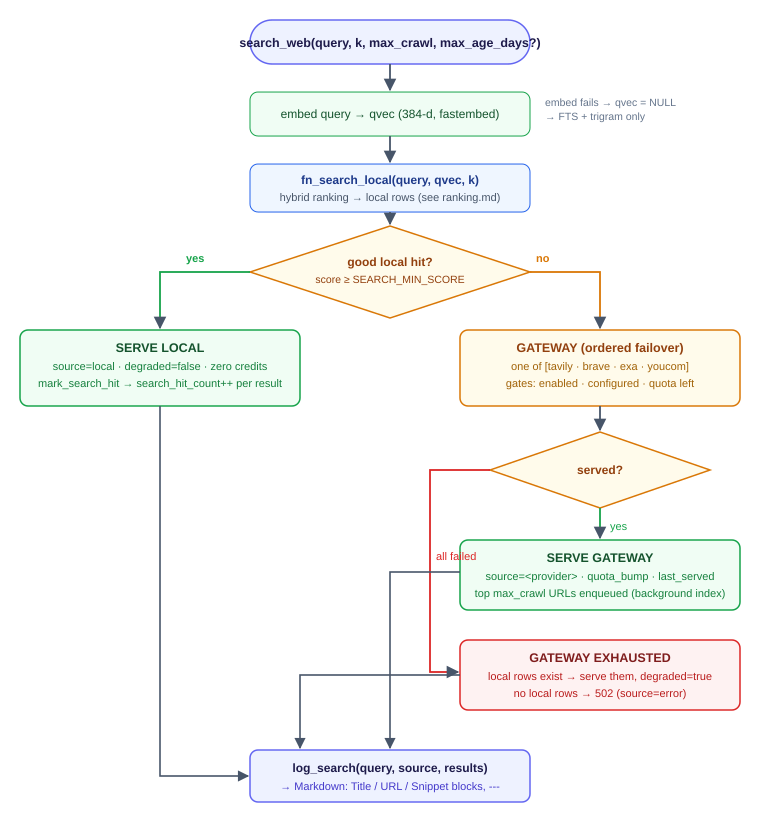

# Search pipeline (`search_web`)

`src/wellisearch/search_web.py` is the single implementation behind both
`GET /api/search` and the MCP `search_web` tool. There is no crawl in the
response path — searches are always served from the local index or from a
provider, and indexing happens in the background.

```
images/search-pipeline.svg
```



## Steps

### 1. Resolve defaults

```python
k       = num_results or SEARCH_K          # default 5
crawl_n = SEARCH_MAX_CRAWL if max_crawl is None else max(0, max_crawl)  # default 5
```

### 2. Embed the query

`embed_one(query)` runs fastembed (`EMBED_MODEL`, 384-d) on a worker thread
(`asyncio.to_thread`). If it fails, the pipeline **degrades gracefully**:
`qvec` is passed as `NULL` and the vector leg of `fn_search_local` is simply
skipped — FTS + trigram still rank.

### 3. Rank the local index

```sql
SELECT * FROM fn_search_local(%s, %s::vector, %s)
```

See [ranking.md](ranking.md) for the full algorithm. Returns at most `k`
rows with `url, title, snippet, score, last_crawled, fetch_count`. If the
function itself errors, `local_rows = []` and the pipeline continues to the
gateway.

**Optional freshness filter**: if `max_age_days` is given, rows with
`last_crawled` older than the cutoff are dropped (rows never crawled are
kept). This is applied *after* ranking, in Python.

### 4. Threshold: is the local result good enough?

```python
good_local = [r for r in local_rows if (r.get("score") or 0) >= SEARCH_MIN_SCORE]
```

`SEARCH_MIN_SCORE` defaults to **0.12**. Because RRF scores are rank-based,
the scale is compressed (typical relevant hits land around 0.10–0.155); the
threshold sits just below the best relevant results and above off-topic
matches. Raising it makes the gateway more aggressive; lowering it serves
more local (and potentially weaker) results. See
[ranking.md § Score scale](ranking.md#score-scale-and-search_min_score) for
how the value was chosen.

### 5a. Local hit → serve (zero provider credits)

- `source = "local"`, `degraded = false`
- results truncated to `k`, each with the snippet capped at 400 chars
- every served page gets `mark_search_hit(url)` → `search_hit_count += 1`
  (the hit-rate signal for the dashboard; the prominence counter
  `fetch_count` is bumped separately by the read path — `fetch_page` /
  `fetch_pages`)

### 5b. No good local hit → provider gateway

`gateway.search(query, k)` walks `SEARCH_PROVIDERS` in order
(default `tavily → brave → searxng`). A provider serves iff it passes all
gates:

1. **enabled** — `provider_state.enabled` (runtime toggle, default true)
2. **configured** — API key / base URL present in env
3. **quota** — `provider_quota.used < limit` for the current month
   (limit = runtime `limit_override` or env default `TAVILY_QUOTA_MONTHLY` /
   `BRAVE_QUOTA_MONTHLY`; `None` = unlimited)
4. **non-empty result set** — a 200 with zero results is a *soft failure*
   and failover continues

Any failure is recorded in `provider_state.last_error` (visible in
`GET /api/providers` and the dashboard) and appended to the error chain.
On success: `quota_bump(provider)` (increments the monthly ledger),
`last_served = now()`, `last_error = NULL`.

If **every** provider fails, the gateway raises `GatewayExhausted(errors)`.

### 6. Degraded mode and hard failure

- `GatewayExhausted` + local rows exist → **degraded mode**: serve the local
  rows anyway, with `source = "local"`, `degraded = true`, and
  `provider_errors` attached. (BLUEPRINT §14.12: better stale than nothing.)
- `GatewayExhausted` + no local rows → `source = "error"`, empty results.
  The REST layer maps this to **HTTP 502**; MCP returns the dict with
  `provider_errors`.

### 7. Speculative indexing (gateway path only)

The top `crawl_n` result URLs are enqueued:

```python
await queue.enqueue(r.url, source="search")   # + debounced kick
```

This is the cache-warming loop: the pages the provider just found are
crawled, chunked, and embedded in the background, so the *next* query for
the same topic is a free local hit. Enqueue is deduped (partial unique index
on `url` for `pending`/`in_flight`), so repeated misses don't pile up work.

### 8. Log + respond

Every request — local, gateway, degraded, error — is logged:

```sql
INSERT INTO search_log (query, source, local_hits, results)
```

`local_hits` is the count of *good* local rows (or all local rows in
degraded mode), so the dashboard can compute local-hit rate over time.

## Response contract

The hard contract is the `results` string — Markdown blocks the LLM can
parse reliably:

```
Title: PostgreSQL 18 Documentation
URL: https://www.postgresql.org/docs/current/
Snippet: The PostgreSQL documentation ...
---
Title: FastAPI MCP server
URL: https://...
Snippet: ...
```

JSON envelope:

| Field | Type | Notes |
|---|---|---|
| `results` | string | the Markdown block(s) above |
| `source` | string | `local` \| `tavily` \| `brave` \| `searxng` \| `error` |
| `degraded` | bool | true only in §6 degraded mode |
| `count` | int | number of result blocks |
| `last_crawled` | string[] | ISO timestamps; present only when `source = local` |
| `provider_errors` | object[] | present only when providers failed |

## Behavioral guarantees

- **Deterministic order** — results come from one ranked SQL function; REST
  and MCP can never disagree.
- **No blocking crawl** — worst-case latency is one embedding + one SQL
  query + (on a miss) one provider call.
- **Quota-safe** — local hits never touch the ledger; a provider that is
  exhausted is skipped before any HTTP call.
- **Self-healing index** — every gateway answer seeds the index for next
  time; every `fetch_page` read of an unindexed URL stores it.
